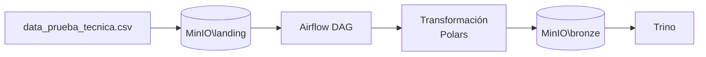

# Ingeniería Data Engineer Challenge

Solución del ejercicio técnico de ingeniería de datos: pipeline ETL orquestado con **Apache Airflow** que ingiere transacciones desde **MinIO**, las limpia y agrega con **Polars**, persiste el resultado en formato **Parquet** y lo expone como tabla externa en **Trino** mediante **Hive Metastore**.

## Arquitectura



| Componente | Rol |
|---|---|
| **Airflow 3.2** | Orquestación del ETL (`read_data` → `transform` → `load_data`) |
| **MinIO** | Object storage S3-compatible (capas landing y bronze) |
| **Polars** | Limpieza, validación y agregación del dataset |
| **Trino** | Motor de consulta SQL sobre tablas externas Parquet |

## Pipeline ETL

El DAG `etl_engineer_challenge` ejecuta tres tareas:

1. **read_data** — Valida que exista el CSV de entrada en el bucket landing.
2. **transform** — Limpia, agrega por `name` + `created_at` y escribe Parquet en el bucket bronze.
3. **load_data** — Crea schema y tabla externa en Trino apuntando al Parquet.

### Reglas de transformación

- Normalización de encabezados y strings (espacios, filas vacías).
- Corrección de nombres de negocio.
- Normalizar `company_id`.
- Filtrado de `status` inválidos.
- Validación y saneamiento de montos (`amount`).
- Conversión de fechas (`created_at`, `paid_at`).
- Agregación con métricas: totales, promedios, máximos, mínimos y montos de transacciones pagadas.

## Requisitos

- Docker y Docker Compose

## Estructura del proyecto

```
.
├── README.md
└── ejercicio1/
    ├── docker-compose.yaml       # Stack completo
    ├── .env                      # Variables de entorno
    ├── data_prueba_tecnica.csv   # Dataset de entrada
    ├── tbl_data.png              # Resultado de consulta en Trino
    ├── Airflow/
    │   ├── dags/
    │   │   └── etl_engineer_challenge.py
    │   └── plugins/
    │       ├── transactions.py
    │       └── hooks/
    │           ├── minio_hook.py
    │           └── trino_hook.py
    ├── Hive/
    │   └── metastore-site.xml
    └── Trino/
        └── etc/
            ├── config.properties
            └── catalog/bronze.properties
```

## Puesta en marcha

1. Configura las variables de entorno en `.env`.
2. Levanta el stack con `docker compose up -d`.
3. En MinIO, crea los buckets definidos en las variables de entorno y sube el CSV de entrada.
4. En la UI de Airflow (**Admin → Connections**), registra las conexiones requeridas por el DAG (ver sección siguiente).
5. Activa y ejecuta el DAG `etl_engineer_challenge`.
6. Consulta la tabla resultante en Trino.

```bash
cd ruta
docker compose up -d
```

Espera a que todos los servicios estén saludables.

### Configurar MinIO

Accede a la consola con las credenciales.

## Conexiones en Airflow

| Connection ID | Tipo | Campos a configurar |
|---|---|---|
| `minio_conn` | Generic | Host, Login, Password |
| `trino_conn` | Generic | Host, Login, Port |

Los valores dependen de la configuración local del stack.

## Respuestas
1. Para los ids nulos ¿Qué sugieres hacer con ellos ?
En general, cualquier valor nulo en un campo relevante debe documentarse como salida del proceso de Data Quality y reportarse al equipo de negocio dueño del dato. Ellos deben determinar si se trata de un error de integridad en la fuente, si el registro puede descartarse, si debe corregirse en origen o si es válido reemplazarlo con un valor por default.
En el caso específico de id, no lo imputaría artificialmente, ya que puede representar una llave de trazabilidad o unicidad.

2. Considerando las columnas name y company_id ¿Qué inconsistencias notas y como las mitigas?
En name se observan valores que parecen ser errores o variantes corruptas de MiPasajefy. Para el ejercicio asumí que se validó con negocio y se confirmó el valor correcto, por lo que se corrigió en el código. Sin embargo, si esto fuera frecuente o existieran múltiples variantes reales, lo ideal sería manejarlo mediante una tabla de homologación o corregir la fuente origen.
Para company_id, se identificaron valores nulos o inválidos y se normalizaron a un valor default identificable (unknown). Esta también debería ser una regla acordada con el dueño del dato. Dado que no es un campo relevante para las agregaciones solicitadas, se conserva el registro sin afectar el resultado final.

3. Para el resto de los campos ¿Encuentras valores atípicos y de ser así cómo procedes?
Sí. En campos relevantes para agregaciones o reportes finales, cualquier valor atípico debe revisarse y tener una regla acordada. En el ejercicio descarté registros con status inválido, simulando que existe un catálogo de estados permitidos, ya que generalmente así es. También traté montos inválidos, infinitos o fuera del rango esperado para una salida con valores nulos, para evitar que contaminen sumas, máximos o promedios.
Además, generé logs informativos con la cantidad de registros o valores descartados y la causa.

4. ¿Qué mejoras propondrías a tu proceso ETL para siguientes versiones?
Agregaría una arquitectura por capas: conservar el archivo original en landing/raw, generar una capa silver con datos limpios y tipados, y publicar las agregaciones en una capa gold. Actualmente el proceso genera directamente el agregado, por lo que no hay tanta visibilidad sobre cómo quedaron los datos después de la limpieza.
También agregaría un proceso formal de Data Quality. Por ejemplo, si name y created_at se usan como llaves de agregación, es necesario validar su integridad antes de transformar. Si vienen nulos o con valores incorrectos, deberían enviarse a una tabla de rechazos o reporte de calidad para corregir la fuente origen o definir nuevas reglas de tratamiento.
En caso de un mayor volumen de datos considerar particionar por fecha o el criterio que se defina.
Mejoras al diseño acorde al volumen, frecuencia de carga, criticidad del dato, trazabilidad y gobierno del dato.

## Autor

Guadalupe Quintal V
