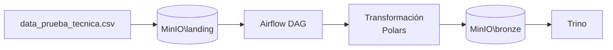

# Ingeniería Data Engineer Challenge

Solución del ejercicio técnico de ingeniería de datos: pipeline ETL orquestado con **Apache Airflow** que ingiere transacciones desde **MinIO**, las limpia y agrega con **Polars**, persiste el resultado en formato **Parquet** y lo expone como tabla externa en **Trino** mediante **Hive Metastore**.

## Arquitectura



| Componente | Rol |
|---|---|
| **Airflow 3.2** | Orquestación del ETL (`read_data` → `transform` → `load_data`) |
| **MinIO** | Object storage S3-compatible (capas landing y bronze) |
| **Polars** | Limpieza, validación y agregación del dataset |
| **Trino** | Motor de consulta SQL sobre tablas externas Parquet |

## Pipeline ETL

El DAG `etl_engineer_challenge` ejecuta tres tareas:

1. **read_data** — Valida que exista el CSV de entrada en el bucket landing.
2. **transform** — Limpia, agrega por `name` + `created_at` y escribe Parquet en el bucket bronze.
3. **load_data** — Crea schema y tabla externa en Trino apuntando al Parquet.

### Reglas de transformación

- Normalización de encabezados y strings (espacios, filas vacías).
- Corrección de nombres de negocio.
- Normalizar `company_id`.
- Filtrado de `status` inválidos.
- Validación y saneamiento de montos (`amount`).
- Conversión de fechas (`created_at`, `paid_at`).
- Agregación con métricas: totales, promedios, máximos, mínimos y montos de transacciones pagadas.

## Requisitos

- Docker y Docker Compose

## Estructura del proyecto

```
.
├── README.md
└── ejercicio1/
    ├── docker-compose.yaml       # Stack completo
    ├── .env                      # Variables de entorno
    ├── data_prueba_tecnica.csv   # Dataset de entrada
    ├── tbl_data.png              # Resultado de consulta en Trino
    ├── Airflow/
    │   ├── dags/
    │   │   └── etl_engineer_challenge.py
    │   └── plugins/
    │       ├── transactions.py
    │       └── hooks/
    │           ├── minio_hook.py
    │           └── trino_hook.py
    ├── Hive/
    │   └── metastore-site.xml
    └── Trino/
        └── etc/
            ├── config.properties
            └── catalog/bronze.properties
```

## Puesta en marcha

1. Configura las variables de entorno en `.env`.
2. Levanta el stack con `docker compose up -d`.
3. En MinIO, crea los buckets definidos en las variables de entorno y sube el CSV de entrada.
4. En la UI de Airflow (**Admin → Connections**), registra las conexiones requeridas por el DAG (ver sección siguiente).
5. Activa y ejecuta el DAG `etl_engineer_challenge`.
6. Consulta la tabla resultante en Trino.

```bash
cd ruta
docker compose up -d
```

Espera a que todos los servicios estén saludables.

### Configurar MinIO

Accede a la consola con las credenciales.

## Conexiones en Airflow

| Connection ID | Tipo | Campos a configurar |
|---|---|---|
| `minio_conn` | Generic | Host, Login, Password |
| `trino_conn` | Generic | Host, Login, Port |

Los valores dependen de la configuración local del stack.

## Autor

Guadalupe Quintal V
